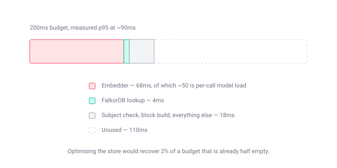
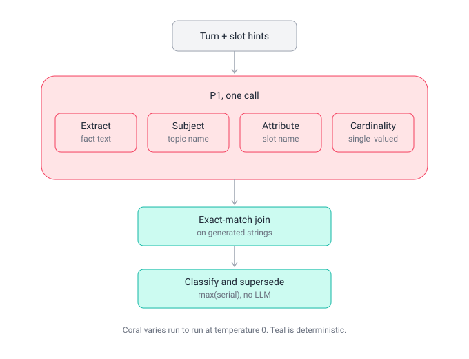
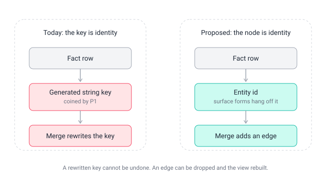
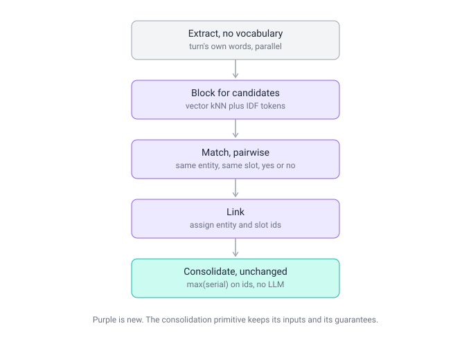
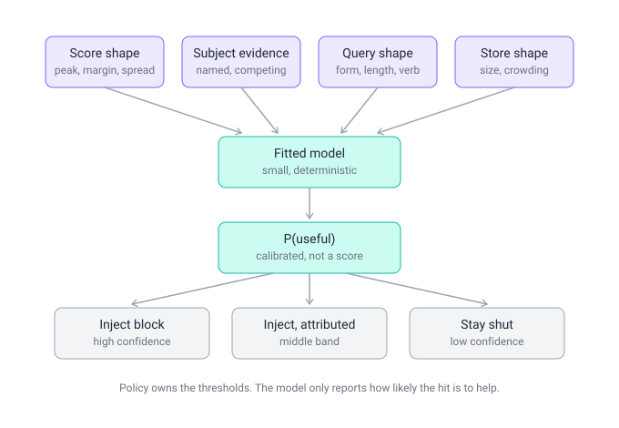
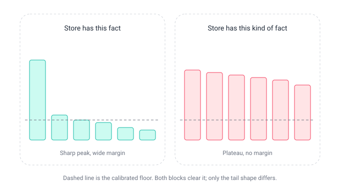
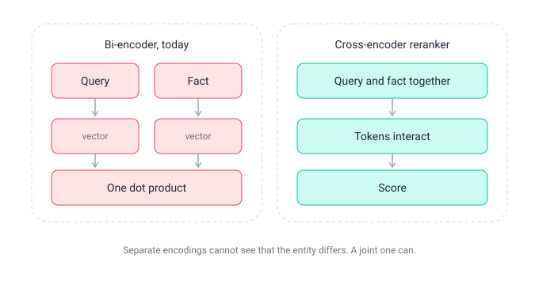
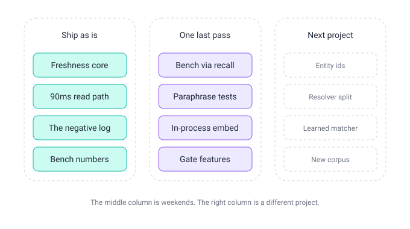
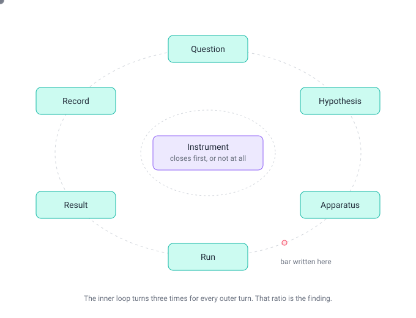
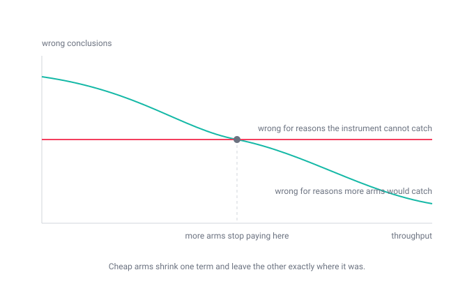

# Memore, explained in pictures

For anyone reading this repo who wants the shape of the thing before the details. The full
record, including everything that failed, is in `RESULTS.md`. This document is the map.

Memore is a memory system for LLMs built on a graph store. Two claims distinguish it: the
freshness decision contains no LLM, and the read path answers in roughly 90ms. The first is
enforced by a test, not by convention. The second is measured, not estimated.

---

## 1. The read path, and where its time goes

The budget is 200ms. Measured p95 is about 90ms, so nearly half is unused.

The interesting part is the distribution. The graph lookup — the component most people assume
is the bottleneck in a graph-backed memory system — is 2.6–4.3ms. Almost all the time is the
embedder, and most of *that* is not embedding: the model server charges 36–56ms of load
overhead per call even with the model resident in VRAM, against roughly 15–20ms of real
compute.

Two consequences worth internalising before optimising anything here. Speeding up the store
would recover about 2% of a budget that is already half empty. And the vector index is 1559
vectors of 1024 dimensions — about 6MB — which is three orders of magnitude below the scale
where a GPU or FPGA index begins to pay.

## 2. The freshness primitive

When two facts contend for the same slot, the newer one wins. That decision is `max(serial)`
over a slot: a pure function, no model call, no judgment. `:Slot` nodes carry the arity
(single-valued or multi-valued), written once on creation and inherited thereafter, with one
deliberate correction path that rewrites no facts.

This is the part of the system that works, and it is worth saying why it matters. Comparable
systems resolve contradictions with an LLM call on the write path. Memore does not, which
means the decision is reproducible, auditable, and testable in isolation — and the test
asserting no model call exists in that path is part of the suite.

## 3. The write lane, which is the open problem

One model call does four jobs: extract the fact, name the subject, name the attribute, and
judge the arity. Everything downstream of it is deterministic. Everything non-deterministic
is inside it.

The two middle jobs are the problem, and the reason is structural rather than a matter of
prompt quality. Naming a subject so that two facts about the same thing collide requires the
model to act as a *hash function*: two independent generations, made at different times with
different context, must normalize to byte-identical text. Generation is not stable under
paraphrase. So an equality test is standing in for what is really a recall problem.

This shows up as identical inputs producing different groupings across sessions. It is
measured, not hidden — `RESULTS.md` §18.5 established that the variance persists at
temperature 0, and the paraphrase test in the suite reports the current rate.

Two rounds of prompt-level work were attempted (§20). Both fixed the target case, both cost
accuracy elsewhere, and the conclusion recorded there is that the prompt has no locality: any
edit moves unrelated behaviour. **Do not run a third round.** That is the most useful negative
result this project produced.

## 4. Why the identity model is the real constraint

Facts are keyed by a generated string. That makes the key *the* identity, so merging two
subjects means rewriting keys, and a wrong merge cannot be undone.

That asymmetry governs every conservative decision in the codebase — a merge destroys a fact,
a split only costs recall — and it is an artefact of the data model rather than a law. If facts
pointed at an entity id, with surface forms hanging off it and a merge recorded as an edge
carrying its evidence, a wrong merge would be a droppable edge and a rebuildable view.

That change would let the system be far more aggressive about merging, which is where the
remaining recall lives. It is also a rebuild rather than a patch, and it is not in this repo.
See §8.

## 5. The direction the write lane should go

The fix is to stop generating identity and start deciding it. Extraction emits propositions in
the turn's own words with no vocabulary to reuse, so it stays parallel. A separate resolver
retrieves a handful of candidate entities and slots, then decides each pair: same, or not, or
coin a new one.

Coining a key is generative over an unbounded space. Deciding whether two propositions share a
subject is discriminative over a candidate set of five. Models are markedly more stable at the
second, and — the part that matters more — each decision becomes a single pair that can be
tested, cached and corrected in isolation. That is the locality §20 found missing.

Specified in `identity-and-gate-spec.md`, not built.

## 6. The gate: deciding when to stay quiet

Retrieval returns something for every query. The gate decides whether it is worth injecting.
Today that is one number compared against one constant.

The measured failure is that a scalar cannot separate the cases. Hard negatives — right
relation, wrong entity — sit at 0.68–0.88 false-open at every calibrated floor, and there are
real positives scoring below the worst negative. No threshold fixes that, because several
signals have already been collapsed into one number before the comparison happens.

Here is the signal a scalar throws away:

A store that holds the answer produces one dominant score. A store that is merely *topical*
about the question produces a flat block of near-equal scores. The top-1 value is nearly
identical in both — which is exactly why the floor is stuck — and the difference is one
subtraction away in data already in memory.

## 7. Considered, and why

The wrong-entity failure is a property of bi-encoding. Query and fact are embedded separately
and meet only as a dot product, so "same relation, different entity" has to survive compression
into 1024 dimensions. A cross-encoder reads both together and the mismatch becomes a
token-level observation. It costs roughly 20–40ms over a k=12 block, which fits in the unused
budget. Specified in `performance-addendum.md`, not built.

Rejected with arithmetic, and listed in `CLAUDE.md` so they are not re-derived: FPGA or GPU
vector indexing (three orders of magnitude below the scale where it pays); a rewrite in another
language (the wall time is in an HTTP call and the store, not the interpreter); a smaller
embedder for speed (measured — same speed, `retrieval_hit` drops 0.93 to 0.76); optimising the
graph lookup (2.6ms).

## 8. Where this stops

The left column works and is what you are looking at. The middle column is the closing pass.
The right column is a different project — a rebuild around entity identity that should start
from that design rather than inherit a generated string key.

The honest summary: the freshness half is solved and the identity half is not, and the identity
half is an open problem across the field rather than a defect specific to this repo.

---

## Appendix: how this was built, and why the failures are written down

Every change here went through the same cycle, and the thing that made it work was not
iteration speed. A control loop cannot have more gain than its sensor has fidelity. Loops
without a good sensor do not converge — they wander, and produce motion that looks like
progress. So the inner loop, the one that validates the measurement apparatus, has to close
first, and in practice it turned several times per outer turn.

That regress bottoms out at determinism: something has to give the identical answer twice or
nothing above it is measurable. The strongest single result in `RESULTS.md` is not a score. It
is a change that provably did nothing, demonstrated by a bit-identical control run.

When experiments are expensive, most of the effort goes into designing them and the instrument
gets scrutinised as a matter of economics. When they are cheap, the run happens before the
instrument is examined — and every result inherits the instrument's validity whether or not
anyone checked. Most of the failures recorded in this repo are measurement failures, not bad
ideas: fixtures that had drifted from the extractor, baselines that no longer reproduced under
unchanged code, an acceptance criterion that would have reported failure for a working change.

The corrections that worked are the ones the empirical sciences already invented for this
exact failure mode. Acceptance criteria written before the run. Control arms. A tell designed
in advance so two arms could be proven distinct. A registry of negative results. A stopping
rule against re-running an experiment that has already answered twice.

That last one is why `CLAUDE.md` carries a "do not" list, and why it is worth reading before
proposing anything to this codebase.
